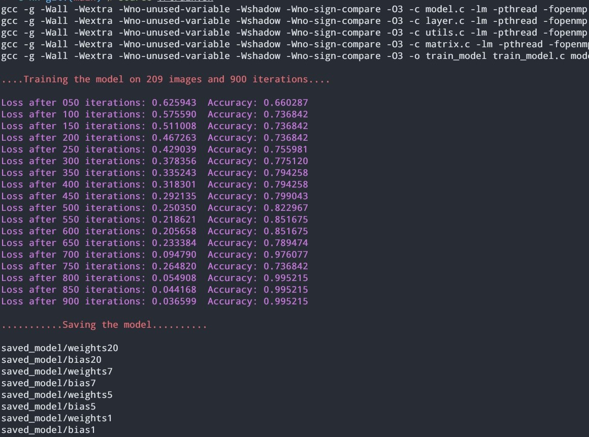
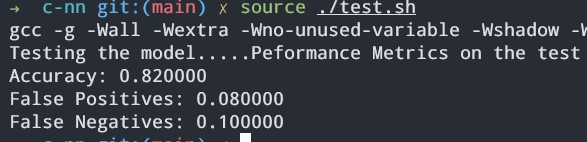
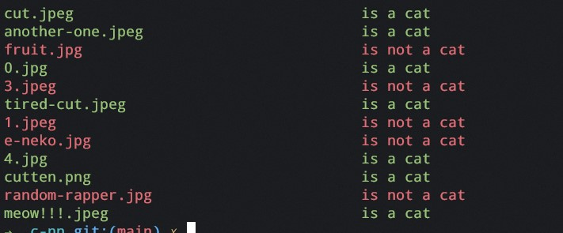

# C-NN 
A basic neural network in standard C, matrices are multiplied on multiple processors using OpenMP

## Getting Started: 
Clone and move into the repository.
```
git clone https://github.com/green-mint/neural-networks-in-C.git && cd neural-networks-in-C
```

## Results:
Three shell scripts are created to automate the training, testing and predicting tasks.

### Training the model:
The model can be trained by running
```
source ./train.sh
```
The files `X` and `y` are used while training. Hyperparameter tuning can be done using the `configs.h` file.



### Testing the model:
The model can be tested by running
```
source ./test.sh
```
The files `test_x` and `test_y` are used while testing. Currently the model obtains **82% accuracy** on the test data.



### Predictions suing the model:
The `demo_imgs` directory hosts images to predict. Save the images to be predict there and run 
```
source ./predict.sh
```
The cat predictions are highlighted in green and non cats are highlighted with red.


## Limitations:
All work was done on linux, although all the libraries used are standard C and available cross platform. But the bash scripts and the makefile created do not work for windows. User may have to manually compile all the binaries and run the model. 
